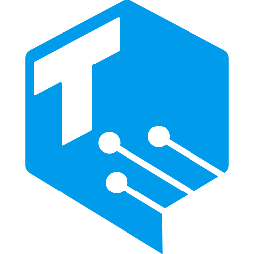

#  Creator NFTs

Template for a cross-platform community hub that supports creators and allows them to provide exclusive content to their most devoted community members. For the fist live example, see [BobNFTs](http://BobNFTs.com). For more details see Toniq Labs' Medium Post [About Bob NFTs](https://toniqlabs.medium.com/about-bob-nfts-de8a5dd01de2).

# Details

-   Frontend in TypeScript.
-   Motoko canisters for minting NFTs and handling backups.
-   Originally bootstrapped with [create-ic-app](https://github.com/MioQuispe/create-ic-app).

# How to setup

1.  Fill in `creatorWalletAddress` in [`canisters/nft/main.mo`](./canisters/nft/main.mo) and [`frontend/src/canisters/nft-canister.ts`](./frontend/src/canisters/nft-canister.ts).
    -   This is the wallet which minting costs will be transferred to, intended to be the creator's wallet.
2.  Fill in `adminDfx` in [`canisters/nft/main.mo`](./canisters/nft/main.mo) and [`canisters/backup.main.mo`](./canisters/backup.main.mo) with your DFX principal.
    -   This, again, should be owned by the creator to give them full access to the canisters.
3.  Fill in `hardcodedCreatorId` in [`frontend/src/data/hardcoded-creator-content.ts`](./frontend/src/data/hardcoded-creator-content.ts).
    -   This is an id specific to the Creator NFTs app. It does not need to be a principal and can be any random string of characters.
4.  Replace flair images in [`frontend/public/flairs/`](./frontend/public/flairs/) and their corresponding base64 encoded strings in [`canisters/nft/imageAssets.mo`](./canisters/nft/imageAssets.mo).
5.  Add your own NFT borders as base64 encoded strings in [`canisters/nft/imageAssets.mo`](./canisters/nft/imageAssets.mo).
6.  Fill in `ledgerC` in [`canisters/nft/main.mo`](./canisters/nft/main.mo) with the principal of a deployed instance of [this Ledger canister](https://github.com/aviate-labs/icp-canister/blob/main/src/ledger/main.rs).
7.  After deploying your NFT canister, add its principal to `nftCanister` in [`canisters/backup/main.mo`](./canisters/backup/main.mo).

All of these are marked to `TODO:` in the code so you can easily track down items you haven't finished yet.

# Running Locally

Setup for dfx `0.8.1`.

## First time setup

DFINITY newbie friendly.

1. Make sure [Node.js](https://nodejs.org) is installed.
2. Install `dfx`, the DFINITY Executor, CLI from [dfinity.org/developers](https://dfinity.org/developers/).
    - Currently the instructions from that link are the following:
        ```bash
        sh -ci "$(curl -fsSL https://smartcontracts.org/install.sh)"
        ```
    - to install an older version of `dfx` (such as `0.8.1` for this project) run the following commands:
        ```bash
        export DFX_VERSION=0.8.1
        sh -ci "$(curl -fsSL https://smartcontracts.org/install.sh)"
        dfx cache install
        ```
        - version 0.8.1 will now automatically be used for this project due to the version property set in `dfx.json`.
3. Install the `vessel` Motoko package manager from https://github.com/dfinity/vessel
    - Download the latest binary for your system [from the releases page](https://github.com/dfinity/vessel/releases/latest).
    - Rename `vessel-<system-name>` to just `vessel`
    - Give it execute permissions with `chmod +x vessel`
    - Move `vessel` to somewhere in your `PATH` (such as `/usr/local/bin` on macOS).
    - Run it to make sure it works
    - If it fails to run on macOS due to security errors, open System Preferences > Security & Privacy > General and allow it to run.
4. Run `npm install` in this repo directory.
5. Run `dfx start --background` (if dfx is running already this will be a no-op).
6. When running locally, open nft/main.mo and uncomment lines 505 & 510 (lines with anonymousPrincipal) to enable authorization for unauthenticated principals in your local environment. Do NOT publish to mainnet with anonymousPrincipal authorized.
7. Run `dfx deploy nft`.
8. Run `npm start` to start the frontend. The frontend will automatically update when relevant code is changed.

## Subsequent runs

Following initial setup, only the following commands need to be run:

1. `dfx start --background` to start DFX (if it's not already running).
2. `dfx deploy nft` to update the NFT canister. (It does not auto-update as code is changed.)
3. `npm start` to start the frontend (if not already running).

# Frontend Architecture

## Frontend file structure

-   [`frontend/dfx-link/`](./frontend/dfx-link): links to `.dfx` in the root directory so that Vite doesn't need to watch anything outside of the `frontend` directory.
-   [`frontend/public/`](./frontend/public): all static assets.
-   [`frontend/src/`](./frontend/src): all source code for the frontend, including all web components.
-   [`frontend/vite/`](./frontend/vite): contains all code needed for Vite configuration.
-   [`frontend/index.html`](./frontend/index.html): the main singe page application for this repo.

## CSS architecture

-   Only raw CSS is used, no pre-compiled language (like Sass or Less).
-   Reusable CSS snippets are stored in TS in [`frontend/src/ui/styles`](./frontend/src/ui/styles).
-   CSS variables are utilized as much as possible to support out-of-the-box reusability and theming.
-   All CSS variables are defined in [`frontend/public/index.css`](./frontend/public/index.css). All new colors should go here.
    -   Most CSS variables are split by theme in that file.
    -   CSS variables are then assigned to a theme in [`frontend/src/ui/styles/theme-classes.ts`](./frontend/src/ui/styles/theme-classes.ts).
    -   Theme assignments are done in that file so that the class themes can be reused anywhere and apply localized theme changes if needed.

## User facing text

-   All text in the frontend should be contained inside of a `phrases` object in each element's `props`. This allows us to easily support translations in the future, if need be, and, as a immediate benefit, consolidates all raw text that is presented to users.

## Frontend Dependencies

These are all installed via `npm install` inside the `frontend` directory.

-   [Vite](https://vitejs.dev) for a local dev server and bundling.
-   [`ic-stoic-identity`](https://www.npmjs.com/package/ic-stoic-identity) for connecting to Stoic Wallet.
-   [`element-vir`](https://www.npmjs.com/package/element-vir) for functional web components. This is a package which wraps [`lit-html`](https://lit.dev) web component creation.
-   [`spa-router-vir`](https://www.npmjs.com/package/spa-router-vir) is a lightweight package for full URL routing and URL sanitizing.
-   [`augment-vir`](https://www.npmjs.com/package/augment-vir) is a small package of common helper functions and types.

# Build architecture

-   GitHub actions runs the root npm script `test:full`.
-   `.fleek.json` is used to configure deployment in Fleek.
    -   To test Vite deploys (which is what Fleek uses) locally, run `npm run build` and then `npm run preview` from the `frontend` directory.
-   For quick local tests, just run `npm test`, either in the root directory or in the `frontend` directory. (There are currently only frontend tests.)

# Canister architecture

## NFT canister

-   Simple implementation of [Toniq Labs’ EXT Standard](https://github.com/Toniq-Labs/extendable-token/).
-   Supports minting an NFT for a given principal with token data.
-   Tokens are generated as SVG images.
-   As a content URL is minted more than once by anyone in the community, that URL's price exponentially increases.

## Backup canister

Creates periodic backups of the NFT canister and its data. Reverting the NFT canister to a previous version can be triggered manually.

# Dev

## Possible Errors

-   `Custom element tags must be interpolated from functional elements`
    -   If you see this that means you're trying to add custom elements that aren't interpolated using the [`element-vir`](https://www.npmjs.com/package/element-vir) library which this repo uses. That is okay, you can simply turn off the check by removing the call to `requireAllCustomElementsToBeFunctionalElement` in [`frontend/src/ui/define-element/define-creator-nft-element.ts`](./frontend/src/ui/define-element/define-creator-nft-element.ts).
-   If you start seeing unexpected canister errors, run `npm run dev:reset` to reset all the canisters.
